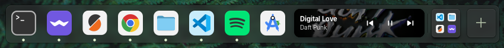
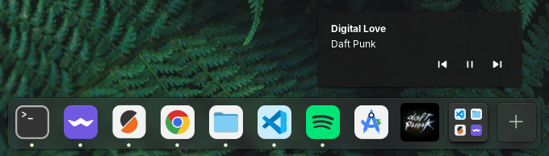

# Dock (elementary OS) - Version con Now Playing

[English](README.md) | [Espanol](README.es.md)

Launcher rapido de aplicaciones y conmutador de ventanas para Pantheon, con widget **Now Playing** integrado en el dock.

## Que es este proyecto

Este repositorio contiene el dock de elementary OS (Pantheon) compilable desde codigo fuente, con una implementacion de **Now Playing** que permite:

- Ver caratula, titulo y artista de lo que se esta reproduciendo.
- Controlar `anterior`, `play/pausa` y `siguiente` desde el dock.
- Usar dos modos visuales: `Normal` (tarjeta completa) y `Minimal` (solo cover con controles en tooltip).

El widget usa MPRIS, por lo que funciona con reproductores compatibles (por ejemplo Spotify, Rhythmbox, etc.).

## Capturas

### Modo Normal



### Modo Minimal



## Requisitos

Para compilar en elementary OS/Ubuntu:

- `meson`
- `ninja-build`
- `valac`
- `libgtk-4-dev`
- `libadwaita-1-dev`
- `libgranite-7-dev`
- `libsoup-3.0-dev`
- `libx11-dev`
- `libwayland-dev`

Instalacion de dependencias:

```bash
sudo apt update
sudo apt install -y \
  meson ninja-build valac \
  libgtk-4-dev libadwaita-1-dev libgranite-7-dev \
  libsoup-3.0-dev libx11-dev libwayland-dev
```

## Instalacion paso a paso (recomendada para probar sin romper el sistema)

### 1. Clonar repositorio

```bash
git clone https://github.com/Juandamian18/Dock-with-Now-Playing.git
cd Dock-with-Now-Playing
```

Si ya lo tenes clonado:

```bash
git pull
```

### 2. Configurar build

```bash
meson setup build --prefix=/usr
```

Si la carpeta `build` ya existe:

```bash
meson setup build --reconfigure --prefix=/usr
```

### 3. Compilar

```bash
ninja -C build
```

### 4. Instalar esta build solo para tu usuario (recomendado)

Esto evita tocar binarios del sistema y deja backup automatico:

```bash
set -euo pipefail
mkdir -p "$HOME/.local/bin" "$HOME/.local/bin/backups"

if [ -f "$HOME/.local/bin/io.elementary.dock" ]; then
  ts="$(date +%Y%m%d-%H%M%S)"
  cp -a "$HOME/.local/bin/io.elementary.dock" \
    "$HOME/.local/bin/backups/io.elementary.dock.$ts"
fi

install -m 0755 build/src/io.elementary.dock "$HOME/.local/bin/io.elementary.dock"
```

### 5. Reiniciar el dock

```bash
pkill -f '^io.elementary.dock$' || true
```

El proceso se vuelve a iniciar automaticamente.

### 6. Verificar que usa tu version local

```bash
which io.elementary.dock
```

Deberia apuntar a:

```text
/home/tu-usuario/.local/bin/io.elementary.dock
```

## Instalacion global (opcional)

Si queres instalar en el sistema completo:

```bash
sudo ninja -C build install
pkill -f '^io.elementary.dock$' || true
```

Nota: esto sobreescribe el binario instalado por paquetes y puede revertirse en futuras actualizaciones del sistema.

## Uso de Now Playing

### Modo Normal

- Se muestra como tarjeta en el dock.
- Fondo con caratula + overlay oscuro para legibilidad.
- Controles inline (`anterior`, `play/pausa`, `siguiente`).

### Modo Minimal

- Se muestra solo el cover con tamano de icono.
- Al hacer hover se abre tooltip con titulo, artista y controles.

Como activarlo:

1. Inicia reproduccion en un player compatible (para que aparezca el item Now Playing en el dock).
2. Haz click derecho sobre el item de Now Playing (cover/tarjeta en el dock).
3. Haz click en `Minimal Mode` en el menu contextual.

Como desactivarlo:

1. Haz click derecho nuevamente sobre el item de Now Playing.
2. Haz click en `Minimal Mode` para desmarcarlo.

### Comportamiento

- Si no hay reproductor activo compatible, Now Playing se oculta.
- Si cerras el reproductor, el item desaparece automaticamente.

## Volver a la version original

### Opcion A: desactivar override local

```bash
rm -f "$HOME/.local/bin/io.elementary.dock"
pkill -f '^io.elementary.dock$' || true
```

### Opcion B: restaurar backup local

```bash
latest_backup="$(ls -1t "$HOME/.local/bin/backups"/io.elementary.dock.* 2>/dev/null | head -n1)"
if [ -n "${latest_backup:-}" ]; then
  cp -a "$latest_backup" "$HOME/.local/bin/io.elementary.dock"
  pkill -f '^io.elementary.dock$' || true
fi
```

## Desarrollo

Compilar en cada cambio:

```bash
ninja -C build
```

Ejecutar tests (si hay definidos en tu entorno):

```bash
ninja -C build test
```

Lint (igual que CI):

```bash
io.elementary.vala-lint -d .
```

## Estructura relevante

- `src/MediaSystem/NowPlayingItem.vala`: UI y comportamiento de Now Playing.
- `src/MediaSystem/MediaMonitor.vala`: integracion MPRIS y estado de reproduccion.
- `src/ItemManager.vala`: integracion del item en layout del dock.
- `data/Application.css`: estilos del dock y del widget.
- `data/dock.gschema.xml`: claves de configuracion (incluye modo minimal).

## Licencia

Este proyecto se distribuye bajo **GPL-3.0**. Ver [LICENSE](LICENSE).
